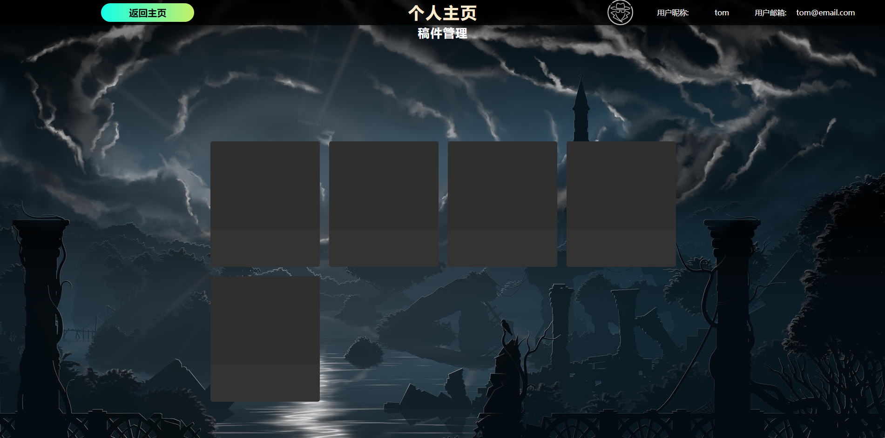
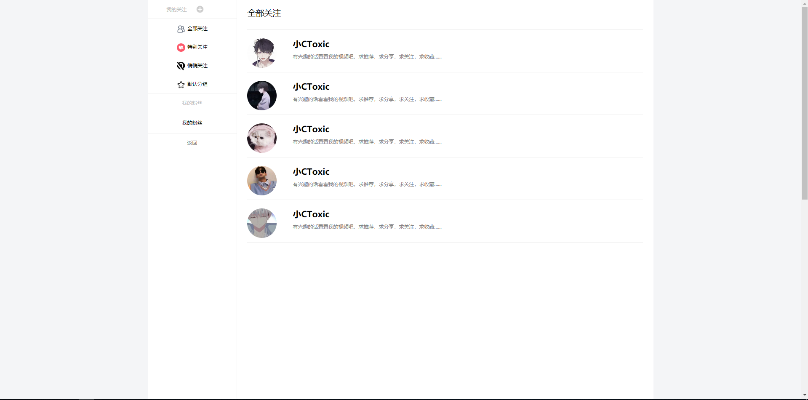
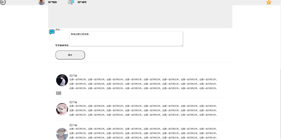

#  **棉花糖论坛** marshmallow

#### 介绍
{**棉花糖论坛（社区）**
  棉花糖论坛是一个供给校园师生交流讨论，在这里可以记录自己的每日 也可以分享、交流，与给予每个人欢乐交流

#### 配置构成

1.  SpringBoot框架
2.  Thymeleaf模板引擎
3.  数据库：Postgres
4.  前端相关:Jquery,Bootstrap，JavaScript等
5.  密码加密：security

#### 功能

1.  登录
2.  注册
3.  忘记密码&修改密码
4.  个人信息
5.  个人主页
6.  发布帖子
7.  点赞&取消点赞
8.  用户回复
9.  我的关注
10. 我的消息

#  **里程碑** 
 **1.用户登入页面**  :relaxed: 

 **2.用户注册界面**  :ok_woman: 

 **3.忘记密码界面**  :bowtie: 

 **4.主页**  :heartbeat: 

 **4.1主页之** TodayHot :blush: 

 **4.1.2主页** footer :stuck_out_tongue: 

 **5.个人信息** 

 **6.信息中心** 

 **7.我的关注** 

8.评论区功能

#  **参与贡献**

1.   **范江北** 
2.   **柯焰明** 
